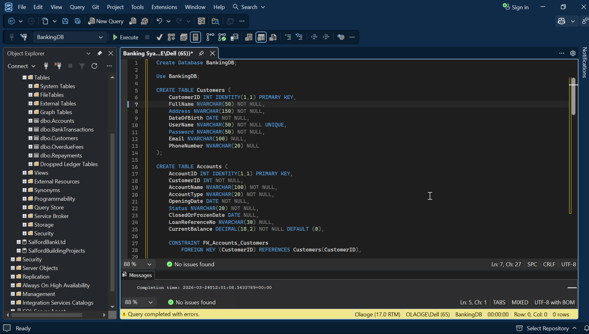
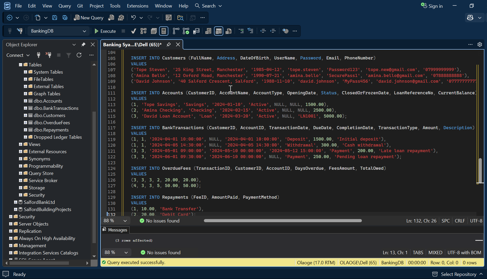
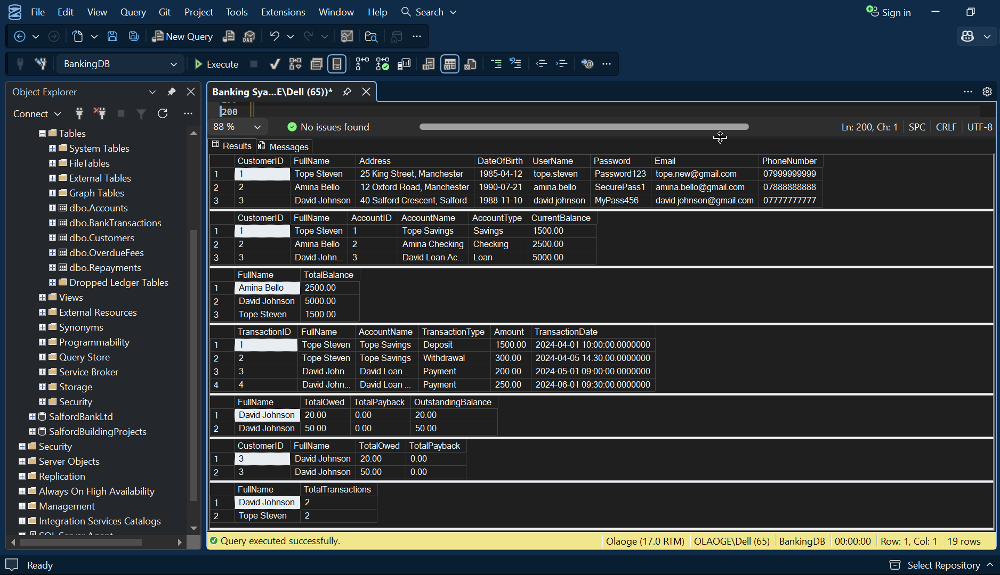
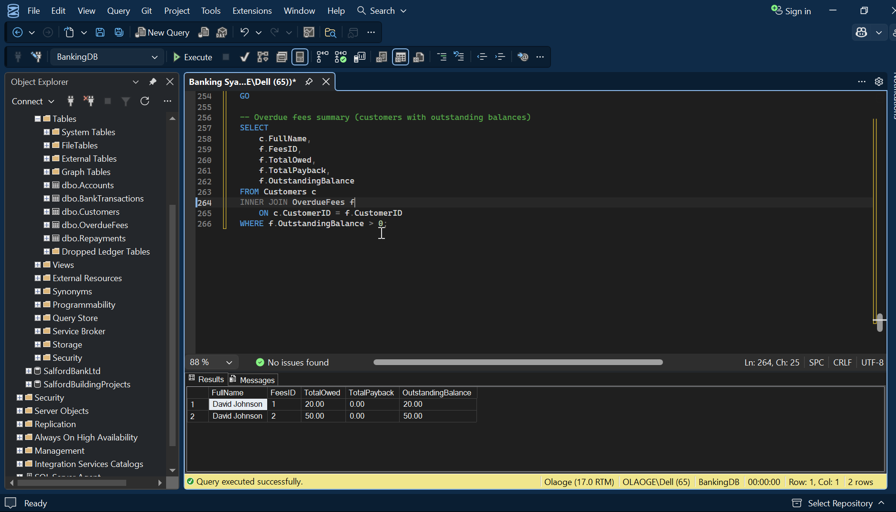
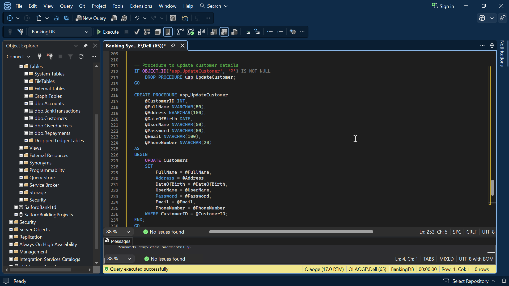
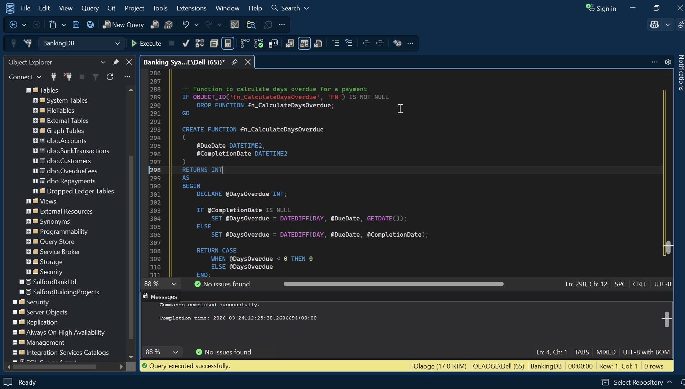

# 🏦 Banking Database System (SQL Server)

## 📌 Overview
This project presents the design and implementation of a SQL Server database system for an online banking platform. The system is built to manage customer information, account details, transactions, overdue fees, and repayments.

---

## 🎯 Objective
The aim of this project is to design a structured relational database that can:
- store customer and account information
- track banking transactions
- manage overdue fees and repayments
- support business reporting through SQL queries, views, functions, and stored procedures

---

## 🛠️ Tools & Technologies
- SQL Server
- T-SQL
- SQL Server Management Studio (SSMS)

---

## 🧱 Database Features
This project includes:
- table creation with primary keys and foreign keys
- constraints for data validation
- sample data insertion
- views for business reporting
- stored procedures for database operations
- user-defined functions for calculations
- test queries for verification

---

## 🗂️ Main Entities
- Customers
- Accounts
- BankTransactions
- OverdueFees
- Repayments

---

## 📁 Project Structure
banking-database-sql/
├── README.md
├── sql/
│   ├── create_tables.sql
│   ├── insert_data.sql
│   ├── queries.sql
│   ├── procedures.sql
│   └── functions.sql
├── images/
│   ├── er-diagram.png
│   └── query-results.png

---

## ✅ Key Business Logic
- each customer can own one or more accounts
- each transaction is linked to a customer and an account
- overdue fees are tracked for late payments
- repayments reduce outstanding balances
- constraints are used to preserve data integrity

---

## 📊 Example Use Cases
- identify customers with overdue payments
- calculate repayment progress
- view account and transaction activity
- support account search and reporting

---

## 🚀 Future Improvements
- add triggers for automatic fee updates
- extend reporting views
- improve security for password handling
- connect the database to a front-end banking application

---

## 🧪 Testing
The database objects were tested in SQL Server Management Studio using sample data and query execution. Testing included table creation, data insertion, joins, stored procedures, and functions to confirm that the system behaves correctly and supports the required business rules.

## 📸 Project Screenshots

### Table Creation

### Sample Data

### Join Query Result

### Overdue Fees Result

### Stored Procedure Execution

### Function Result

## 👤 Author
Segun Olaoge
